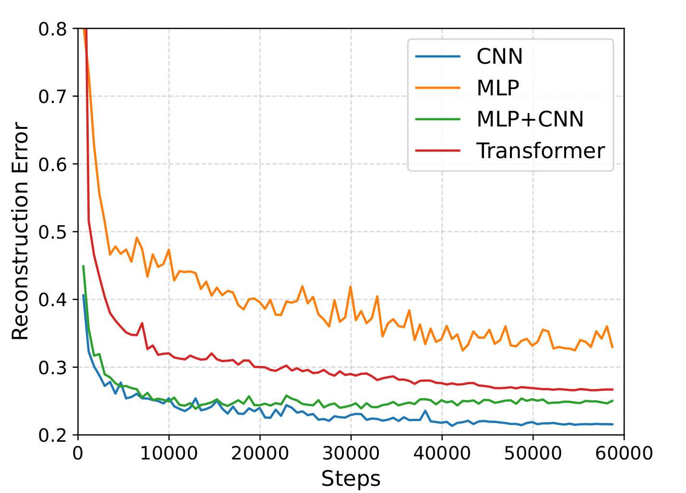

# Generating Synthetic Genotypes using Diffusion Models

The Repository for generating synthetic genetics data with Diffusion Models.

## Abstract

In this paper, we introduce the first diffusion model designed to generate complete synthetic human genotypes, which, by standard protocols, one can straightforwardly expand into full-length, DNA-level genomes.
The synthetic genotypes mimic real human genotypes without just reproducing known genotypes, in terms of approved metrics. When training biomedically relevant classifiers with synthetic genotypes, accuracy is near-identical to the accuracy achieved when training classifiers with real data. We further demonstrate that augmenting small amounts of real with synthetically generated genotypes drastically improves performance rates. This addresses a significant challenge in translational human genetics: real human genotypes, although emerging in large volumes from genome wide association studies, are sensitive private data, which limits their public availability. Therefore, the integration of additional, insensitive data when striving for rapid sharing of biomedical knowledge of public interest appears imperative.

## Install

Dependencies:

- [pytorch](https://pytorch.org) <3
- [numpy](https://numpy.org/install/) <3

for replication:
- `pip install wandb` for optional logging <3
- for easy replication use conda and environment.yml eg:
`$ conda env create -f environment.yml` and `$ conda activate sls3`

## Results:
When generating synthetic data and training on this synthethic data the resulting accuracy on real validation data is displayed here:


Training for the different Models converges nicely as can be seen below:




## Replicating Results
For replicating the ALS Results run:

```
$ python main_als.py
```
The script expects the sigSNPs_pca.features.pkl to be in the data/sigSNPs_pca.features.pkl path. This data is not provided by this repository.


If you want to train the model on the 1KG data use https://github.com/HaploKit/DiseaseCapsule/blob/master/data_preprocessing/gene_pca.py on the VCF files from https://www.internationalgenome.org/ to produce gene_pca.features.pkl and move it into the data folder.
```
$ python main_1k.py
```
will then replicate the results on the 1KG genome dataset
